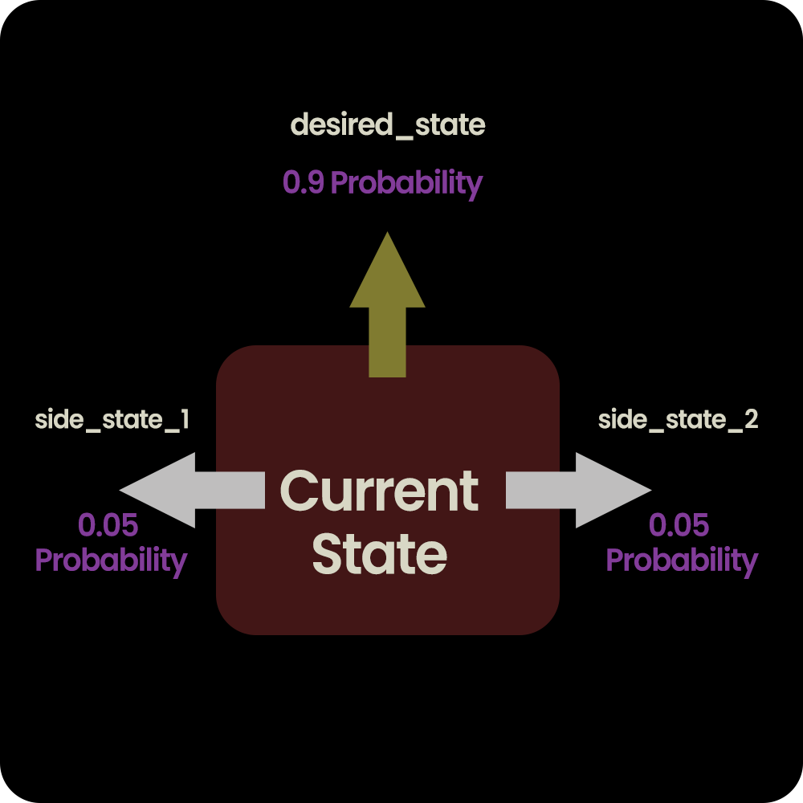

# Assignment 2 - Markov Decision Process


## Assignment overview

*   Pretend an agent is trying to plan how to act in a 3x2 world.
Figure 1 shows the world, the rewards associated with each state, and the dynamics.
*   There are 5 possible actions: north, east, south, west and stay still. The first 4 actions
succeed with probability 0.9 and go to a right angle of the desired direction with
probability 0.05: See figure 2 for an illustration of this.
* The fifth action, “do nothing,”
succeeds with probability 1.
*   The rewards associated with each state are
R(1 : 6) = [−0.1, − 0.1, + 1, − 0.1, − 0.1, − 0.05] respectively and are also shown in figure 1.
*   State 3 is the only terminal state.
*   Goal is to calculating utilities and then deciding best policies for each state.

Figure 1 :
#### States
4 |  5|6
:-------------------------:|:-------------------------:|:-------------------------:
1  |  2|3

#### Immediate Rewards
-0.01|  -0.01|-0.05
:-------------------------:|:-------------------------:|:-------------------------:
-0.01  |  -0.01|0 

* Utility of 3 = +1

Figure 2 :



## Implementation details
*   This implementation is only sutable for the given 3 by 2 world.
*    Utilities are initialized to be 0 other than in the terminal state, which is 1.
*   `gamma` is the discount.
*   `epsilon` decides the precision to terminate iteration.
*   `delta` is the highest variation of utility of all the states when compared with their respective previous  utility approximations in the previous iteration.
*   Numbers from 0 to 4 has been used to specify the actions.
    *   0 - up
    *   1 - East
    *   2 - Down
    *   3 - West
    *   4 - Do Nothing

*    `q_star(current_state, action)` returns the Q star values for the given action being in the given position. 
        *   `get_state(current_state,action)` works just as same as a look up table, returning the state in the given direction(passed as the `action` parameter) to the current state.
             

### Pseudo code of the function implementation

```plaintext
 FUNCTION get_state_utilities(epsilon, rewards)
    SET utilities to list of 6 zeros
    SET delta to epsilon + 1
    SET gamma to 0.999

    FUNCTION q_star(current_state, action)
        FUNCTION get_state(action, current_state)
            IF action equals 0 THEN
                IF current_state is greater than or equal to 3 THEN
                    RETURN current_state
                ELSE
                    RETURN current_state + 3
                END IF
            ELSE IF action equals 2 THEN
                IF current_state is less than or equal to 2 THEN
                    RETURN current_state
                ELSE
                    RETURN current_state - 3
                END IF
            ELSE IF action equals 3 THEN
                IF current_state modulo 3 equals 0 THEN
                    RETURN current_state
                ELSE
                    RETURN current_state - 1
                END IF
            ELSE IF action equals 1 THEN
                IF current_state modulo 3 equals 2 THEN
                    RETURN current_state
                ELSE
                    RETURN current_state + 1
                END IF
            END IF

        IF action is greater than 4 or less than 0 THEN
            RAISE ValueError("Action must be between 0 and 4")
        IF action equals 4 THEN
            RETURN rewards[current_state] + gamma * old_utilities[current_state]

        SET side_state_1 to get_state(action - 1 if action is not 0 else 3, current_state)
        SET desired_state to get_state(action, current_state)
        SET side_state_2 to get_state(action + 1 if action is not 3 else 0, current_state)

        SET q_star_value to 0.05 * (rewards[side_state_1] + gamma * old_utilities[side_state_1]) + 0.05 * (rewards[side_state_2] + gamma * old_utilities[side_state_2]) + 0.9 * (rewards[desired_state] + gamma * old_utilities[desired_state])
        RETURN q_star_value
    END FUNCTION

    WHILE delta is greater than epsilon * (1 - gamma) / gamma DO
        SET delta to 0
        SET old_utilities to a copy of utilities
        FOR current_state in range(length of rewards) DO
            IF current_state equals 2 THEN
                SET utilities[2] to 1
                CONTINUE
            END IF

            SET utilities[current_state] to maximum of q_star(current_state, 0), q_star(current_state, 1), q_star(current_state, 2), q_star(current_state, 3), q_star(current_state, 4)
            SET delta to maximum of delta, absolute value of old_utilities[current_state] - utilities[current_state]
        END FOR
        PRINT utilities, delta
    END WHILE

    RETURN utilities
END FUNCTION

CALL get_state_utilities with arguments 0.01 and [-0.1, -0.1, 0, -0.1, -0.1, -0.05]

```
## Important points
 * Iteration process does not apply to the terminal state(state 3).
 *  Terminal state does not have any actions. Termination happens there.
 *  If an action taken being in a boundary state results in hitting the walls, then the expected outcome of the action will be ending up in the same state, but with a probability of 0.9. If there are sides in the side_states too, then those outcomes will also be ending up in the remaining state itself.  
## About Markov Decision Process

A Markov Decision Process (MDP) is a mathematical framework used to model decision-making in situations where outcomes are partly random and partly under the control of a decision-maker. It is widely employed in the fields of artificial intelligence, operations research, control theory, and reinforcement learning. The MDP framework is particularly useful in modeling dynamic systems where decisions made at each step affect not only the immediate reward but also the subsequent state and future rewards.

In an MDP, the decision-maker interacts with an environment that is characterized by a set of states, actions, transition probabilities, and rewards. The key concept in an MDP is the Markov property, which states that the future is independent of the past given the present state. This property implies that the state transition probabilities and the rewards only depend on the current state and action, not on the history of states and actions leading up to the current state.

The main goal of solving an MDP is to find an optimal policy, which is a set of rules that determines the action to be taken at each state in order to maximize the cumulative expected reward over time. Various algorithms, such as dynamic programming, reinforcement learning, and stochastic optimization, are used to compute or approximate the optimal policy in an MDP.

MDPs have a wide range of applications, including but not limited to robotics, automated decision-making systems, finance, healthcare, and natural language processing. They provide a formal and powerful framework for analyzing and solving decision-making problems in complex, uncertain, and dynamic environments.
